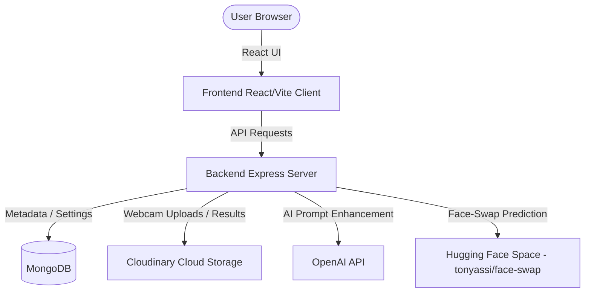

# 📸 AI PhotoBooth 🚀

A premium, full-stack, responsive web application that lets users capture a photo of themselves via webcam and seamlessly transform into various high-quality personas (e.g., Business Professional, Doctor, Festive outfits) while preserving their facial identity.

🔗 **Live Deployment:** [https://ai-photobooth-bfen.onrender.com](https://ai-photobooth-bfen.onrender.com)

---

## 🌟 Key Features

*   **⚡ Identity-Preserving Face Swap:** Uses advanced machine learning to seamlessly swap the user's face onto pre-defined style templates, maintaining realistic lighting, expression, and high-fidelity features.
*   **⚙️ Custom AI Settings Panel:** A premium, glassmorphic Settings modal accessible from any screen via a floating gear icon. Users can select which OpenAI model configuration (GPT-4o, GPT-4o-mini, GPT-5.5, etc.) they want to use.
*   **🧠 OpenAI Prompt Enhancement:** Integrates with OpenAI APIs to dynamically rewrite and enhance style prompts based on the user's name, gender, and selected template before face-swapping. Features auto-mapping for futuristic models and safe fallback modes if the API key is not set.
*   **💾 Robust State Persistence:** Restores the exact session state (name, gender, chosen template, captured webcam photo, and generated AI image) even if the page is accidentally refreshed. Integrates local storage with backend status checks.
*   **⬇️ Blob-Based Programmatic Download:** Fixed legacy navigation bugs. Replaced tab-redirection with a client-side Blob-based download mechanism that allows users to save high-resolution images instantly without losing their session context or QR codes.
*   **📲 Dynamic QR Code Sharing:** Generates a real-time QR code mapping directly to the Cloudinary-hosted final portrait. Users can scan the code to instantly view and save their portraits on their mobile devices.
*   **🎨 Premium Glassmorphism UI:** Built with dark theme gradients, micro-animations, interactive particles, and fluid responsive layouts customized for both desktop and mobile viewports.

---

## 🏗️ System Architecture

The project is structured as a monorepo split into a React/Vite client and a Node.js/Express server connecting to MongoDB and external cloud APIs:



---

## 🛠️ Technology Stack

*   **Frontend Client:**
    *   React.js (Functional components, hooks, custom state)
    *   Vite (High-performance bundler)
    *   Vanilla CSS (Modern custom variables, animations, glassmorphic styling)
*   **Backend Server:**
    *   Node.js & Express (REST APIs)
    *   Mongoose (MongoDB Object Modeling)
    *   Dotenv (Secure configuration management)
*   **Cloud & AI Integrations:**
    *   **OpenAI SDK** (Prompt enhancement via LLMs)
    *   **Gradio Client** (Face swap prediction model)
    *   **Cloudinary SDK** (Image hosting and content delivery network)
    *   **QRCode** (Dynamic QR matrix generation)

---

## 📊 Database Schemas (MongoDB)

### 1. `Session` Schema
Tracks active photobooth sessions, user configurations, prompt logs, generation durations, and generated links:
```js
{
  sessionId: { type: String, required: true, unique: true },
  userName: { type: String, required: true },
  gender: { type: String, default: null },
  selectedTemplate: {
    id: { type: String, default: null },
    name: { type: String, default: null },
    imageUrl: { type: String, default: null }
  },
  rawUserImageUrl: { type: String, default: null },
  generatedImageUrl: { type: String, default: null },
  status: { type: String, default: 'started' }, // 'started' | 'gender_selected' | 'template_selected' | 'captured' | 'generating' | 'completed' | 'failed'
  selectedModel: { type: String, default: 'gpt-4o' },
  generatedPrompt: { type: String, default: null },
  generationTimestamp: { type: Date, default: null },
  generationDuration: { type: Number, default: null }, // In milliseconds
  formAnswers: {
    gender: { type: String, default: null },
    templateId: { type: String, default: null },
    templateName: { type: String, default: null }
  },
  createdAt: { type: Date, default: Date.now }
}
```

### 2. `AppSettings` Schema
Stores global key-value configuration flags (such as the selected model):
```js
{
  key: { type: String, required: true, unique: true }, // e.g., 'selectedModel'
  value: { type: mongoose.Schema.Types.Mixed, required: true },
  updatedAt: { type: Date, default: Date.now }
}
```

---

## 🔌 API Endpoints

### Session Management
*   `POST /api/sessions` — Initializes a new session with `userName`.
*   `PATCH /api/sessions/:sessionId/gender` — Updates session gender selection (`male` / `female`).
*   `PATCH /api/sessions/:sessionId/template` — Saves the chosen template ID.
*   `POST /api/sessions/:sessionId/capture` — Uploads raw base64 webcam photo, enhances the prompt via OpenAI, and starts background face-swapping.
*   `GET /api/sessions/:sessionId/status` — Returns status, user variables, and generated output URLs.
*   `GET /api/sessions/:sessionId/qr` — Returns base64 QR code data mapping to the final image.

### App Settings
*   `GET /api/settings` — Returns current application settings and the list of available models.
*   `PUT /api/settings` — Updates the selected AI model configuration.

### Style Templates
*   `GET /api/templates/:gender` — Returns lists of pre-defined style templates filtered by gender.

---

## ⚙️ Setup & Local Installation

### 1. Clone the repository
```bash
git clone https://github.com/Ananya0424/AI-Photobooth.git
cd AI-Photobooth
```

### 2. Configure Environment Variables
Create a `.env` file inside the `backend` directory:
```env
PORT=5000
NODE_ENV=development

# MongoDB Connection
MONGODB_URI=mongodb://localhost:27017/ai-photobooth

# App Security
SESSION_SECRET=your_session_secret_key_here

# Cloudinary Credentials (Image Uploads)
CLOUDINARY_CLOUD_NAME=your_cloudinary_cloud_name
CLOUDINARY_API_KEY=your_cloudinary_api_key
CLOUDINARY_API_SECRET=your_cloudinary_api_secret

# AI Models (Optional - will run in mock mode if empty)
HUGGING_FACE_API_TOKEN=your_hugging_face_token
OPENAI_API_KEY=your_openai_api_key
```

### 3. Run the Application
You can launch both the frontend client and the backend server concurrently from the root directory:
```bash
# Installs all client and server dependencies and starts the app
npm run build
npm start
```
*Alternatively, you can run `npm run dev` inside `backend` and `frontend` directories to launch hot-reloading development servers.*

---

## 🚀 Production Deployment (Render)

This repository is optimized for deployment as a unified Web Service using **Render Blueprint** specs (`render.yaml`):

1. Go to **Render.com** and connect your GitHub repository.
2. Select **Web Service** or use the **Blueprints** tab to auto-discover `render.yaml`.
3. Set your environment variables in the Render Dashboard (`MONGODB_URI`, `CLOUDINARY_CLOUD_NAME`, `CLOUDINARY_API_KEY`, `CLOUDINARY_API_SECRET`, `HUGGING_FACE_API_TOKEN`, `OPENAI_API_KEY`, etc.).
4. Click **Deploy**. Render will automatically build the static React bundle, copy it to the public backend distribution folder, and start the node server.
